## Backend Engineer

기술보다 문제에 집중하고, 늘 배우는 개발자입니다.

### 🔍 Currently
- 🔭 부하 테스트 기반 성능 병목 분석 및 개선
- 🌱 Build Your Own X로 기술의 동작 원리 학습 중
- 🔐 보안 위협에 대비한 안전한 인프라 환경 및 로직 구성

### 🌐 Socials:
 
 

### 💻 Tech Stack:
 
 
 
 
 
 
 

### 📊 GitHub Stats:

<!-- ### 🔝 Top Contributed Repo
 -->

<!-- Proudly created with GPRM ( https://gprm.itsvg.in ) -->

<!--
**mon0mon/mon0mon** is a ✨ _special_ ✨ repository because its `README.md` (this file) appears on your GitHub profile.

Here are some ideas to get you started:

- 🔭 I’m currently working on ...
- 🌱 I’m currently learning ...
- 👯 I’m looking to collaborate on ...
- 🤔 I’m looking for help with ...
- 💬 Ask me about ...
- 📫 How to reach me: ...
- 😄 Pronouns: ...
- ⚡ Fun fact: ...
-->

